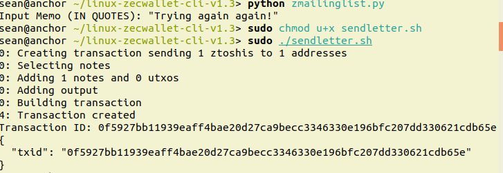

# Python Zcash Memo Mailer
## To be used with Zecwallet Lite CLI on **LINUX**

This python script will open a file in the same directory named "mailinglist.txt" that has a z-address on every line (example provided), and ask the user to input a memo. It will then assemble a z_sendmany transaction with a 1 zatoshi output and the memo for each recipient listed in mailinglist.txt . You will then need to change the mode of the sendletter.sh script so you can execute it. `sudo chmod u+x sendletter.sh`. Then to send out your memos `sudo ./sendletter.sh`.

Make sure to put these files in your zecwallet-cli folder. This way when you run the sendletter.sh script it will invoke the zecwallet lite client to send out the memos. If you want to send out different letters you will have to delete the sendletter.sh file so a new one can be created.

